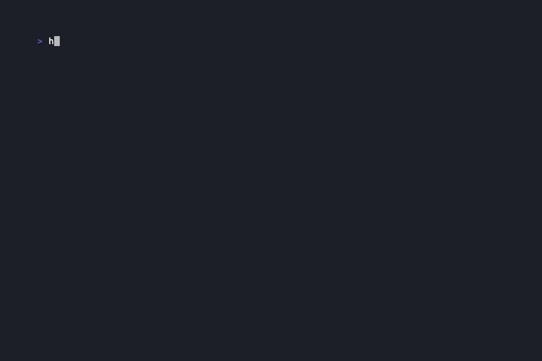
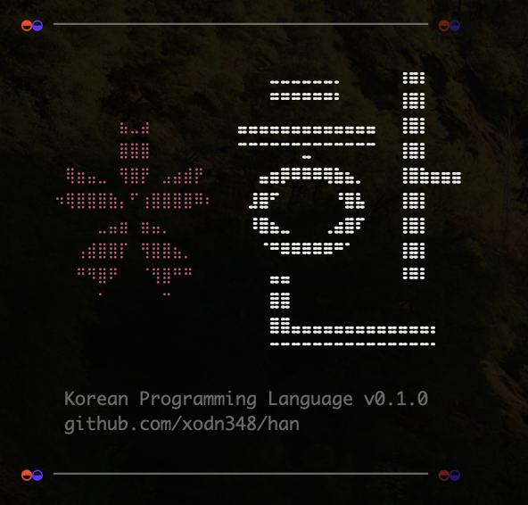

# Han (한) Programming Language

> A general-purpose compiled language with Korean keywords — written in Rust

<p align="center">
  <a href="https://xodn348.github.io/han/playground/"></a>
  <a href="https://xodn348.github.io/han/introduction.html"></a>
  <a href="https://github.com/xodn348/han"></a>
  <a href="https://github.com/xodn348/han/blob/main/LICENSE"></a>
</p>

<p align="center">
  
</p>

<p align="center">
  
</p>

---

## Mission

Han is not just a programming language. It is an experiment with three goals:

**1. Hangul is one of the most scientifically designed writing systems ever created**
Each character encodes the exact shape of the mouth and tongue used to pronounce it. Vowels are composed from three symbols: heaven (·), earth (ㅡ), and human (ㅣ). It was engineered for clarity, not inherited from history. Han asks: what does code look like when written in a script that was *designed* rather than evolved? *(Invented 1443 — King Sejong)*

**2. Korean Code for the AI Age — BPE optimization**
LLMs are trained on English-dominant data. BPE tokenizers treat Korean characters as rare, splitting `함수` into multiple byte-level tokens while `function` becomes one. The more Korean code exists on the internet — in repos, in documentation, in examples — the better future tokenizers will represent the Korean language. Han is a small contribution to that corpus.

**3. Minority Language as First-Class Syntax**
Korean is spoken by ~80 million people, yet essentially zero programming languages use it as syntax. Han is an experiment: what happens when a minority language becomes the grammar of a compiler? How far can it go?

---

## About

Han is a statically-typed, compiled programming language where every keyword is written in Korean. It compiles to native binaries through LLVM IR and also ships with a tree-walking interpreter for instant execution. The compiler toolchain is written entirely in Rust.

---

## Features

- **Korean keywords** — `함수`, `만약`, `이면`, `반복`, `변수` — write logic in Hangul
- **Korean word order** — `만약 조건 이면 { }`, `조건 동안 { }` — Korean-default conditionals and natural sentence structure
- **Korean logical operators** — `그리고` (and), `또는` (or)
- **Pipe operator** — `값 |> 함수1 |> 함수2`
- **Hangul identifiers** — name your variables and functions in Korean
- **Compiled language** — generates LLVM IR → clang → native binary
- **Interpreter mode** — run instantly without clang
- **Python interop** — `파이썬()` / `파이썬_값()` for NumPy, PyTorch, and existing Python libraries
- **REPL** — interactive mode with `hgl repl`
- **LSP server** — `hgl lsp` for editor hover docs and completion
- **`hgl check`** — type-check without running
- **`hgl init`** — project scaffolding
- **Static typing** — 5 primitive types: `정수` (int), `실수` (float), `문자열` (string), `불` (bool), `없음` (void)
- **Arrays** — `[1, 2, 3]`, indexing, negative indexing, `.추가/.삭제/.정렬/.역순` etc.
- **Structs** — `구조 사람 { 이름: 문자열 }` with field access and impl blocks
- **Closures** — `변수 f = 함수(x: 정수) { 반환 x * 2 }` with env capture
- **Pattern matching** — `맞춤 값 { 1 => ..., _ => ... }`
- **Error handling** — `시도 { } 처리(오류) { }` try/catch
- **File I/O** — `파일읽기`, `파일쓰기`, `파일추가`, `파일존재`
- **Format strings** — `형식("이름: {0}", 이름)` positional or `형식("이름: {이름}")` named
- **String interpolation** — `"${expr}"` auto-desugars to `형식()`
- **String methods** — `.분리`, `.포함`, `.바꾸기`, `.대문자`, `.소문자`, etc.
- **Module imports** — `포함 "파일.hgl"`
- **Generics syntax** — `함수 최대값<T>(a: T, b: T) -> T`
- **Built-in math** — `제곱근`, `절댓값`, `거듭제곱`, `사인`, `코사인`, `탄젠트`, `로그`, `로그10`, `지수`, `올림`, `내림`, `반올림`, `최대`, `최소`, `난수`, `파이`, `자연상수`, `정수변환`, `실수변환`, `길이`
- **Linear algebra** — `행렬곱`, `전치`, `스칼라곱`, `행렬합`, `행렬차`, `내적`, `외적`, `단위행렬`, `텐서곱`
- **HashMap** — `사전("키", 값)` with `.키목록()`, `.값목록()`, `.포함()`, `.삭제()`
- **JSON** — `제이슨_파싱()`, `제이슨_생성()` via serde_json
- **HTTP** — `HTTP_포함(url)`, `HTTP_보내기(url, body)` via reqwest
- **Regex** — `정규식_찾기()`, `정규식_일치()`, `정규식_바꾸기()`
- **Date/Time** — `현재시간()`, `현재날짜()`, `타임스탬프()`
- **System** — `실행()`, `환경변수()`, `명령인자()`
- **Type checker** — compile-time type validation
- **18 example programs** — from hello world to HTTP API calls

---

## Quick Start

Create `hello.hgl`:

```
출력("안녕하세요, 세계!")
```

Run it:

```bash
hgl interpret hello.hgl
# Output: 안녕하세요, 세계!
```

Conditionals support both the Korean-default `만약 조건 이면 { }` form and the older minimal form without `이면`. The docs use the Korean-default form:

```hgl
만약 x > 0 이면 {
    출력("양수")
} 아니면 {
    출력("0 또는 음수")
}
```

Or jump into the REPL:

```bash
hgl repl
한> 출력("안녕!")
안녕!
```

---

## Practical Examples

### Word Counter

```
변수 텍스트 = "hello world hello han world hello"
변수 단어들 = 텍스트.분리(" ")
변수 단어목록 = []
변수 개수목록 = []

반복 변수 i = 0; i < 단어들.길이(); i += 1 {
    변수 찾음 = 거짓
    반복 변수 j = 0; j < 단어목록.길이(); j += 1 {
        만약 단어목록[j] == 단어들[i] 이면 {
            개수목록[j] = 개수목록[j] + 1
            찾음 = 참
        }
    }
    만약 찾음 == 거짓 이면 {
        단어목록.추가(단어들[i])
        개수목록.추가(1)
    }
}

반복 변수 i = 0; i < 단어목록.길이(); i += 1 {
    출력(형식("{0}: {1}", 단어목록[i], 개수목록[i]))
}
```

```
hello: 3
world: 2
han: 1
```

### String Calculator

```
함수 계산(식: 문자열) -> 정수 {
    변수 부분 = 식.분리(" ")
    변수 왼쪽 = 정수변환(부분[0])
    변수 연산자 = 부분[1]
    변수 오른쪽 = 정수변환(부분[2])

    맞춤 연산자 {
        "+" => { 반환 왼쪽 + 오른쪽 }
        "-" => { 반환 왼쪽 - 오른쪽 }
        "*" => { 반환 왼쪽 * 오른쪽 }
        "/" => {
            만약 오른쪽 == 0 이면 {
                출력("오류: 0으로 나눌 수 없습니다")
                반환 0
            }
            반환 왼쪽 / 오른쪽
        }
        _ => {
            출력(형식("알 수 없는 연산자: {0}", 연산자))
            반환 0
        }
    }
}

출력(계산("10 + 20"))     // 30
출력(계산("6 * 7"))       // 42
```

### Todo List with Structs

```
구조 할일 {
    제목: 문자열,
    완료: 불
}

변수 목록 = []

함수 추가하기(목록: [할일], 제목: 문자열) {
    목록.추가(할일 { 제목: 제목, 완료: 거짓 })
}

함수 완료처리(목록: [할일], index: 정수) {
    목록[index].완료 = 참
}

함수 출력목록(목록: [할일]) {
    반복 변수 i = 0; i < 목록.길이(); i += 1 {
        변수 상태 = "[ ]"
        만약 목록[i].완료 이면 {
            상태 = "[✓]"
        }
        출력(형식("{0} {1}. {2}", 상태, i + 1, 목록[i].제목))
    }
}

추가하기(목록, "한글 프로그래밍 언어 만들기")
추가하기(목록, "README 작성하기")
추가하기(목록, "HN에 올리기")

완료처리(목록, 0)
완료처리(목록, 1)

출력("=== 할일 목록 ===")
출력목록(목록)
```

```
=== 할일 목록 ===
[✓] 1. 한글 프로그래밍 언어 만들기
[✓] 2. README 작성하기
[ ] 3. HN에 올리기
```

### File Line Counter

```
함수 줄수세기(경로: 문자열) -> 정수 {
    시도 {
        변수 내용 = 파일읽기(경로)
        변수 줄들 = 내용.분리("\n")
        반환 줄들.길이()
    } 처리(오류) {
        출력(형식("오류: {0}", 오류))
        반환 0
    }
}

파일쓰기("/tmp/test.txt", "첫번째 줄\n두번째 줄\n세번째 줄\n")
출력(형식("줄 수: {0}", 줄수세기("/tmp/test.txt")))
```

```
줄 수: 4
```

---

## Installation

### Prerequisites

- [Rust](https://rustup.rs) (1.70+)
- clang (for `hgl build` / `hgl run`) — `xcode-select --install` or `brew install llvm`

### Install

```bash
git clone https://github.com/xodn348/han.git
cd han
./install.sh
```

This installs `hgl` globally and automatically sets up the VS Code extension (syntax highlighting + LSP) if VS Code is detected.

---

## CLI Usage

```
hgl interpret <file.hgl>    Run with interpreter (no clang needed)
hgl build <file.hgl>        Compile to native binary (requires clang)
hgl run <file.hgl>          Compile and run immediately
hgl check <file.hgl>        Type-check only (no execution)
hgl init [name]             Create new Han project
hgl repl                    Interactive REPL
hgl lsp                     Start LSP server (hover + completion)
```

---

## What Han Can Do Right Now

### ✅ Fully Working

**Data types**
- Integers (`정수`), floats (`실수`), strings (`문자열`), booleans (`불`), `없음` (null)
- Arrays with negative indexing — `arr[-1]` returns the last element
- Nested arrays — `[[1, 2], [3, 4]]`, `중첩[1][1]` → `4`
- Structs with field access and mutation — `사람.이름 = "홍길동"`
- Nested structs — `직원.주소.도시 = "부산"`
- Tuples — `(1, "hello", 참)`, access with `.0`, `.1`
- Enums — `열거 방향 { 위, 아래 }`, access with `방향::위`
- HashMap — `사전("키", 값)`, nested: `사전["키"]["내부키"]`
- Float/Int auto-coercion — `1 + 1.5 = 2.5`

**Control flow**
- Conditionals in both Korean-default and minimal forms — the docs use `만약 x > 0 이면 { }`, and the older minimal form remains supported
- `반복` for-loop with init, condition, step
- `반복 x 안에서 배열` for-in loop — iterates arrays, strings, ranges
- While loops in both SOV and SVO order — `n < 5 동안 { }` and `동안 n < 5 { }`
- `멈춰` (break), `계속` (continue)
- `그리고` / `또는` logical operators — Korean aliases for `&&` / `||`
- `|>` pipe operator — `a |> f` becomes `f(a)`, and `a |> f(b)` becomes `f(a, b)`
- `맞춤` pattern matching — integer, string, bool, wildcard `_`, binding
- Range operator — `0..10` creates `[0, 1, 2, ..., 9]`

**Functions**
- Named functions with typed parameters and return types
- Recursion (fibonacci, factorial, etc.)
- Closures / anonymous functions with environment capture — `변수 f = 함수(x: 정수) { 반환 x * 2 }`
- Closures passed as arguments
- Higher-order functions — `함수 적용(f: 함수, x: 정수) -> 정수`

**Strings**
- Concatenation with `+`
- Interpolation — `"${이름}님 안녕하세요"` desugars to `형식()`
- Methods: `.분리(sep)`, `.포함(s)`, `.바꾸기(from, to)`, `.앞뒤공백제거()`, `.대문자()`, `.소문자()`, `.시작(s)`, `.끝(s)`, `.길이()`
- Character indexing — `문자열[0]`, negative: `문자열[-1]`
- Method chaining — `"hello world".대문자().분리(" ")`

**Arrays**
- Methods: `.추가(v)`, `.삭제(i)`, `.길이()`, `.포함(v)`, `.역순()`, `.정렬()`, `.합치기(sep)`
- Index read/write — `arr[i]`, `arr[i] = v`
- Negative indexing — `arr[-1]`

**HashMap / Dictionary**
- Create: `사전("키", 값, "키2", 값2)` or `사전()`
- Index: `map["키"]`, assign: `map["키"] = 값`
- Methods: `.키목록()`, `.값목록()`, `.길이()`, `.포함(키)`, `.삭제(키)`
- Nested maps — `사전("a", 사전("b", 1))`

**Structs & methods**
- Define: `구조 사람 { 이름: 문자열, 나이: 정수 }`
- Instantiate: `변수 p = 사람 { 이름: "홍길동", 나이: 30 }`
- Impl block methods with `자신` (self): `구현 사람 { 함수 인사(자신: 사람) { ... } }`

**Error handling**
- `시도 { } 처리(오류) { }` — catches any runtime error including division by zero, file not found, out-of-bounds
- Elm-style error messages include source context for faster debugging
- Stack traces on function call errors

**Type safety**
- Compile-time type checker — `변수 x: 정수 = "hello"` → error
- `hgl check <file.hgl>` validates types without executing the program
- Return type validation — wrong return type detected before execution

**JSON** (serde_json)
- `제이슨_파싱(문자열)` → Han value, `제이슨_생성(값)` → JSON string
- Roundtrip: Han → JSON → Han preserves structure

**HTTP** (reqwest)
- `HTTP_포함(url)` — GET, `HTTP_보내기(url, body)` — POST with JSON

**Regex**
- `정규식_찾기(패턴, 텍스트)`, `정규식_일치()`, `정규식_바꾸기()`

**Date/Time** (chrono)
- `현재시간()`, `현재날짜()`, `타임스탬프()`

**System**
- `실행(명령어)` — shell command, `환경변수()`, `명령인자()`, `잠자기()`
- `타입(값)` — runtime type introspection

**Python interop**
- `파이썬(코드)` executes Python code and returns captured stdout as a string
- `파이썬_값(표현식)` evaluates a Python expression and converts the value back into Han automatically
- Use it to reach NumPy, PyTorch, or any installed Python package without leaving Han

**File I/O**
- `파일읽기("path")` — reads whole file to string
- `파일쓰기("path", content)` — writes string to file
- `파일추가("path", content)` — appends to file
- `파일존재("path")` — returns bool

**Math builtins**
- `제곱근(x)`, `절댓값(x)`, `거듭제곱(밑, 지수)`, `사인(x)`, `코사인(x)`, `탄젠트(x)`
- `로그(x)`, `로그10(x)`, `지수(x)`, `올림(x)`, `내림(x)`, `반올림(x)`
- `최대(a, b)`, `최소(a, b)`, `난수()`, `난수(a, b)`, `파이()`, `자연상수()`
- `정수변환(x)`, `실수변환(x)`, `길이(s)`
- `행렬곱(A, B)`, `전치(A)`, `스칼라곱(A, s)`, `행렬합(A, B)`, `행렬차(A, B)` — matrix ops
- `내적(a, b)`, `외적(a, b)`, `단위행렬(n)`, `텐서곱(A, B)` — vector/tensor ops

**Format strings**
- Named: `형식("이름: {이름}, 나이: {나이}")` — substitutes from current scope
- Positional: `형식("이름: {0}, 나이: {1}", 이름, 나이)`

**Modules**
- `포함 "파일.hgl"` — runs another `.hgl` file in the current scope

**Generics syntax**
- `함수 최대값<T>(a: T, b: T) -> T` — type params are parsed and erased at runtime

**HashMap/Dictionary**
- `사전("키", 값, "키2", 값2)` — key-value store
- Indexing: `map["키"]`, assignment: `map["키"] = 값`
- Methods: `.키목록()`, `.값목록()`, `.길이()`, `.포함()`, `.삭제()`

**JSON**
- `제이슨_파싱(문자열)` → Han value, `제이슨_생성(값)` → JSON string
- `제이슨_예쁘게(값)` — pretty-printed JSON

**HTTP**
- `HTTP_포함(url)` — GET request, `HTTP_보내기(url, body)` — POST request

**Regex**
- `정규식_찾기(패턴, 텍스트)`, `정규식_일치(패턴, 텍스트)`, `정규식_바꾸기(패턴, 텍스트, 대체)`

**Date/Time**
- `현재시간()`, `현재날짜()`, `타임스탬프()`

**System**
- `실행(명령어)` — shell command, `환경변수(이름)`, `명령인자()`, `잠자기(밀리초)`

**Type introspection**
- `타입(값)` → `"정수"`, `"문자열"`, `"배열"`, `"사전"`, etc.

**Type checker**
- `변수 x: 정수 = "hello"` → compile-time type error

**Stack traces**
- Function call chain shown on runtime errors

---

### ⚠️ Partial / Edge Cases

| Feature | Status |
|---------|--------|
| `hgl build` enum match lowering | Enum variant IR generation is still in progress |

---

### ❌ Not Yet Implemented

| Feature | Notes |
|---------|-------|
| Null safety / Option type | No `없음?` or Option<T> |
| Async / concurrency | Single-threaded only |
| Garbage collection | Reference counting only via `Rc<RefCell<>>` — cycles leak |
| Tail call optimization | Deep recursion will stack overflow |

---

## Why Han?

<details>
<summary>The Beauty of Hangul</summary>

Hangul (한글) is not just a writing system — it is a feat of deliberate linguistic design. Created in 1443 by King Sejong the Great, each character encodes phonetic information in its geometric shape. Consonants mirror the tongue and mouth positions used to pronounce them. Vowels are composed from three cosmic symbols: heaven (·), earth (ㅡ), and human (ㅣ).

Han brings this elegance into programming. When you write `함수 피보나치(n: 정수) -> 정수`, you are not just defining a function — you are writing in a script that was purpose-built for clarity and beauty.

Hangul is also surprisingly easy to learn — [you can learn the whole system in an afternoon](https://korean.stackexchange.com/a/213).

</details>

<details>
<summary>Riding the Korean Wave</summary>

The global interest in Korean culture has never been higher. From K-pop and Korean cinema to Korean cuisine and language learning, millions worldwide are engaging with Korean culture. Over 16 million people are actively studying Korean as a foreign language.

Han offers these learners something unexpected: a way to practice reading and writing Hangul through programming. It bridges the gap between cultural interest and technical skill, making Korean literacy functional in a domain where it has never existed before.

</details>

---

## Learn Korean Through Coding

Every keyword in Han is a real Korean word. If you're learning Korean, writing Han code is a way to practice reading Hangul in context.

| Code | Pronunciation | Meaning | What it does |
|------|--------------|---------|-------------|
| `함수` | ham-su | function (math term) | defines a function |
| `만약` | man-yak | if/suppose | starts a conditional |
| `이면` | i-myeon | then/if-then | marks the Korean-default conditional ending |
| `반환` | ban-hwan | return/give back | returns a value |
| `변수` | byeon-su | variable (math term) | declares a mutable variable |
| `반복` | ban-bok | repetition | for loop |
| `동안` | dong-an | during/while | while loop |
| `출력` | chul-ryeok | output | prints to console |
| `참` | cham | true/truth | boolean true |
| `거짓` | geo-jit | false/lie | boolean false |
| `구조` | gu-jo | structure | defines a struct |
| `아니면` | a-ni-myeon | otherwise | else branch |
| `멈춰` | meom-chwo | stop | break |
| `계속` | gye-sok | continue | continue |
| `시도` | si-do | attempt | try block |
| `처리` | cheo-ri | handling/processing | catch block |
| `맞춤` | mat-chum | matching/fit | pattern match |
| `포함` | po-ham | include/contain | import module |
| `그리고` | geu-ri-go | and (conjunction) | logical AND |
| `또는` | tto-neun | or (alternative) | logical OR |

Reading Han code is reading Korean. Every identifier, every keyword, every method name — it's all real language.

[Learn Hangul in an afternoon →](https://korean.stackexchange.com/a/213)

---

## Token Analysis (AI/LLM)

We tested Han code against Python and JavaScript using GPT-4o's tokenizer (tiktoken):

| Program | Han | Python | JavaScript |
|---------|-----|--------|------------|
| Fibonacci | 88 tokens | 54 tokens | 69 tokens |

**Han uses more tokens, not fewer.** Korean keywords average 2-3 tokens each vs 1 for English. This is because BPE (Byte Pair Encoding) tokenizers are trained on English-dominant data — `function` appears billions of times and merges into a single token, while `함수` is rare and gets split into byte-level pieces.

This is a tokenizer training bias, not a property of Korean. If BPE were trained on Korean-heavy data, `함수` could easily be a single token.

Relevant discussion: [Ukrainian LLM Lapa replaced 80K tokens and achieved 1.5x efficiency](https://news.ycombinator.com/item?id=47381382)

---

<details>
<summary><strong>Language Guide</strong></summary>

### Variables and Constants

```
변수 이름 = 42              // mutable variable
변수 메시지 = "안녕하세요"     // string variable
상수 파이 = 3.14            // immutable constant
```

With explicit type annotations:

```
변수 나이: 정수 = 25
변수 키: 실수 = 175.5
변수 이름: 문자열 = "홍길동"
변수 활성: 불 = 참
```

### Functions

```
함수 더하기(가: 정수, 나: 정수) -> 정수 {
    반환 가 + 나
}

함수 인사(이름: 문자열) {
    출력("안녕하세요, " + 이름)
}
```

### Conditionals

Han still supports the older minimal conditional form, but the Korean-default docs style uses `이면`:

```hgl
만약 점수 >= 90 이면 {
    출력("A")
} 아니면 점수 >= 80 이면 {
    출력("B")
} 아니면 {
    출력("C")
}
```

### Loops

**For loop** (`반복`):

```
반복 변수 i = 0; i < 10; i += 1 {
    출력(i)
}
```

**While loop** (`동안`):

SOV:

```hgl
변수 n = 0
n < 5 동안 {
    출력(n)
    n += 1
}
```

SVO alternative:

```hgl
변수 n = 0
동안 n < 5 {
    출력(n)
    n += 1
}
```

**Loop control** — `멈춰` (break) and `계속` (continue):

```
반복 변수 i = 0; i < 100; i += 1 {
    만약 i == 50 이면 {
        멈춰
    }
    만약 i % 2 == 0 이면 {
        계속
    }
    출력(i)
}
```

</details>

<details>
<summary><strong>Example Programs</strong></summary>

### Factorial

```
함수 팩토리얼(n: 정수) -> 정수 {
    만약 n <= 1 이면 {
        반환 1
    }
    반환 n * 팩토리얼(n - 1)
}

함수 main() {
    출력(팩토리얼(10))
}

main()
```

Output: `3628800`

### Sum 1 to 100

```
함수 합계(n: 정수) -> 정수 {
    변수 합 = 0
    반복 변수 i = 1; i <= n; i += 1 {
        합 += i
    }
    반환 합
}

함수 main() {
    출력(합계(100))
}

main()
```

Output: `5050`

### Even/Odd Checker

```
함수 main() {
    반복 변수 i = 1; i <= 10; i += 1 {
        만약 i % 2 == 0 이면 {
            출력("짝수")
        } 아니면 {
            출력("홀수")
        }
    }
}

main()
```

</details>

<details>
<summary><strong>Keyword Reference</strong></summary>

| Keyword | Meaning | English Equivalent |
|---------|---------|-------------------|
| `함수` | function definition | `fn` / `function` |
| `반환` | return value | `return` |
| `변수` | mutable variable | `let mut` / `var` |
| `상수` | immutable constant | `const` |
| `만약` | conditional | `if` |
| `이면` | conditional marker | `then` / `if-then` |
| `아니면` | else branch | `else` |
| `그리고` | and (logical) | `&&` |
| `또는` | or (logical) | `||` |
| `반복` | for loop | `for` |
| `동안` | while loop | `while` |
| `멈춰` | break loop | `break` |
| `계속` | continue loop | `continue` |
| `참` | boolean true | `true` |
| `거짓` | boolean false | `false` |
| `출력` | print to console | `print` |
| `입력` | read from console | `input` |

</details>

<details>
<summary><strong>Type System & Operators</strong></summary>

| Type | Description | LLVM Type | Examples |
|------|-------------|-----------|----------|
| `정수` | 64-bit integer | `i64` | `42`, `-10` |
| `실수` | 64-bit float | `f64` | `3.14`, `-0.5` |
| `문자열` | UTF-8 string | `i8*` | `"안녕하세요"` |
| `불` | boolean | `i1` | `참`, `거짓` |
| `없음` | void / no value | `void` | (function return type) |

| Operator | Description |
|----------|-------------|
| `+`, `-`, `*`, `/`, `%` | Arithmetic |
| `==`, `!=` | Equality |
| `<`, `>`, `<=`, `>=` | Comparison |
| `&&`, `\|\|`, `!`, `그리고`, `또는` | Logical |
| `=`, `+=`, `-=`, `*=`, `/=` | Assignment |

</details>

<details>
<summary><strong>Design and Architecture</strong></summary>

### How Han Works

Han follows the classical compiler pipeline, implemented entirely in Rust with zero external compiler dependencies (LLVM IR is generated as plain text):

```
Source (.hgl)
    │
    ▼
┌─────────┐     ┌─────────┐     ┌─────────┐
│  Lexer  │ ──▶ │ Parser  │ ──▶ │   AST   │
│(lexer.rs)│    │(parser.rs)│   │ (ast.rs) │
└─────────┘     └─────────┘     └────┬────┘
                                     │
                        ┌────────────┼────────────┐
                        ▼                         ▼
                ┌──────────────┐         ┌──────────────┐
                │ Interpreter  │         │   CodeGen    │
                │(interpreter.rs)│       │ (codegen.rs) │
                └──────┬───────┘         └──────┬───────┘
                       │                        │
                       ▼                        ▼
                  Direct Output           LLVM IR (.ll)
                                               │
                                               ▼
                                         clang → Binary
```

### Project Structure

```
han/
├── src/
│   ├── main.rs          CLI entry point (hgl command)
│   ├── lexer.rs         Lexer: Korean source → token stream
│   ├── parser.rs        Parser: tokens → AST (recursive descent)
│   ├── ast.rs           AST node type definitions
│   ├── interpreter.rs   Tree-walking interpreter
│   ├── codegen.rs       LLVM IR text code generator
│   └── lsp.rs           LSP server (hover + completion)
├── editors/
│   └── vscode/          VS Code extension (syntax highlighting + LSP)
├── examples/            Example .hgl programs
├── spec/
│   └── SPEC.md          Formal language specification (EBNF)
└── tests/               Integration tests
```

### Design Decisions

**Why text-based LLVM IR instead of the LLVM C API?**
Han generates LLVM IR as plain text strings, avoiding the complexity of linking against LLVM libraries. This keeps the build simple (`cargo build` — no LLVM installation required) while still producing optimized native binaries through clang.

**Why both interpreter and compiler?**
The interpreter enables instant execution without any toolchain dependencies beyond Rust. The compiler path exists for production use where performance matters. Same parser, same AST, two backends.

**Why Rust?**
Rust's enum types map naturally to AST nodes and token variants. Pattern matching makes parser and interpreter logic clear and exhaustive. Memory safety without garbage collection suits a language toolchain.

</details>

---

## Running Tests

```bash
cargo test
```

`cargo test` currently covers the lexer, parser, AST, interpreter, type checker, compiled backend, and integration scenarios such as closure capture, struct impl methods, tuples, and SOV parsing.

---

## License

MIT

---

<p align="center">
  <em>Han — where the beauty of Hangul meets the precision of code.</em>
</p>
