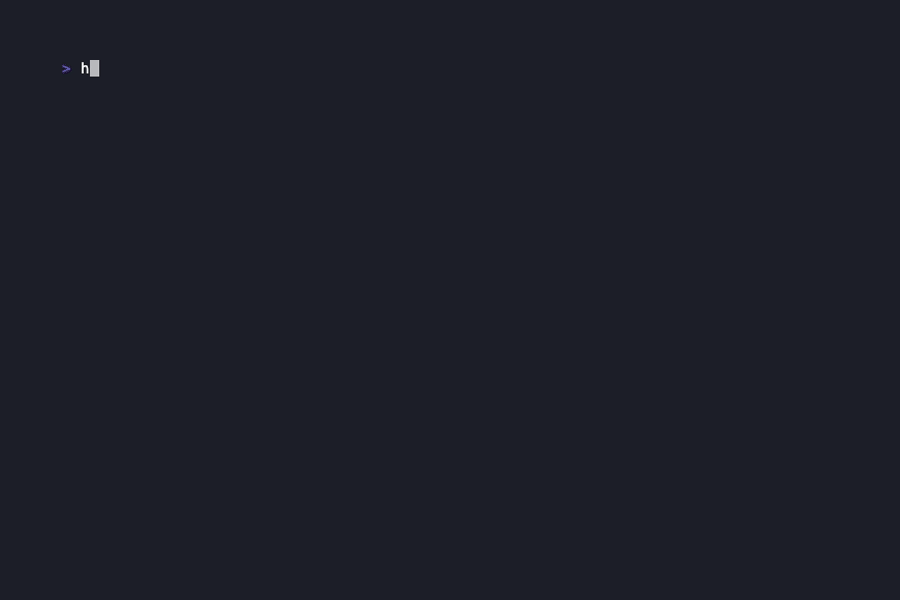
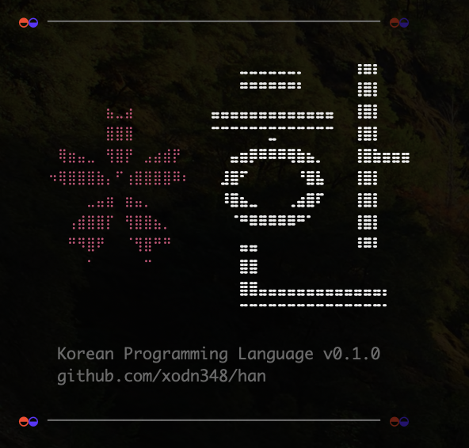

# Han (한) Programming Language

> A general-purpose compiled language with Korean keywords, types, built-ins, and standard library — written in Rust

<p align="center">
  <a href="https://xodn348.github.io/han/playground/"></a>
  <a href="https://xodn348.github.io/han/introduction.html"></a>
  <a href="https://github.com/xodn348/han"></a>
  <a href="https://github.com/xodn348/han/blob/main/LICENSE"></a>
</p>

<p align="center">
  
</p>

<p align="center">
  
</p>

---

## Mission

Han is not just a programming language. It is an experiment with three goals:

**1. Hangul is one of the most scientifically designed writing systems ever created**
Each character encodes the exact shape of the mouth and tongue used to pronounce it. Vowels are composed from three symbols: heaven (·), earth (ㅡ), and human (ㅣ). It was engineered for clarity, not inherited from history. Han asks: what does code look like when written in a script that was *designed* rather than evolved? *(Invented 1443 — King Sejong)*

**2. Korean Code for the AI Age — BPE optimization**
LLMs are trained on English-dominant data. BPE tokenizers treat Korean characters as rare, splitting `함수` into multiple byte-level tokens while `function` becomes one. The more Korean code exists on the internet — in repos, in documentation, in examples — the better future tokenizers will represent the Korean language. Han is a small contribution to that corpus.

**3. Minority Language as First-Class Syntax**
Korean is spoken by ~80 million people, yet essentially zero programming languages use it as syntax. Han is an experiment: what happens when a minority language becomes the grammar of a compiler? How far can it go?

---

## About

Han is a statically-typed, compiled programming language where keywords, type names, 50+ built-in functions, and standard library methods are written in Korean — with all error messages in Korean too. Arithmetic, comparison, and assignment operators follow C/Rust conventions. It compiles to native binaries through LLVM IR and also ships with a tree-walking interpreter for instant execution. The compiler toolchain is written entirely in Rust.

---

## Quick Start

Create `hello.hgl`:

```
출력("안녕하세요, 세계!")
```

Run it:

```bash
hgl interpret hello.hgl
# Output: 안녕하세요, 세계!
```

Conditionals use the Korean-default `만약 조건 이면 { }` form:

```hgl
만약 x > 0 이면 {
    출력("양수")
} 아니면 {
    출력("0 또는 음수")
}
```

Or jump into the REPL:

```bash
hgl repl
한> 출력("안녕!")
안녕!
```

---

## Key Examples

### String Calculator

```
함수 계산(식: 문자열) -> 정수 {
    변수 부분 = 식.분리(" ")
    변수 왼쪽 = 정수변환(부분[0])
    변수 연산자 = 부분[1]
    변수 오른쪽 = 정수변환(부분[2])

    맞춤 연산자 {
        "+" => { 반환 왼쪽 + 오른쪽 }
        "-" => { 반환 왼쪽 - 오른쪽 }
        "*" => { 반환 왼쪽 * 오른쪽 }
        "/" => { 반환 왼쪽 / 오른쪽 }
        _ => { 반환 0 }
    }
}

출력(계산("10 + 20"))     // 30
출력(계산("6 * 7"))       // 42
```

### Todo List with Structs

```
구조 할일 {
    제목: 문자열,
    완료: 불
}

변수 목록 = []
목록.추가(할일 { 제목: "한글 프로그래밍 언어 만들기", 완료: 참 })
목록.추가(할일 { 제목: "README 작성하기", 완료: 거짓 })

반복 변수 i = 0; i < 목록.길이(); i += 1 {
    변수 상태 = "[ ]"
    만약 목록[i].완료 이면 { 상태 = "[✓]" }
    출력(형식("{0} {1}. {2}", 상태, i + 1, 목록[i].제목))
}
```

More examples — including word counting, file I/O, JSON, HTTP, regex, and a full 10-step tutorial series — live in the [`examples/`](./examples/) directory and the [Examples Index](https://xodn348.github.io/han/examples/index.html) in the docs.

---

## Features at a glance

- **Korean keywords** — `함수`, `만약`, `이면`, `반복`, `변수`, `상수`, `반환`, `구조`, `시도`, `처리`, `맞춤`
- **Korean word order** — `만약 조건 이면 { }`, `조건 동안 { }` (SOV) and `동안 조건 { }` (SVO)
- **Korean logical operators** — `그리고` (and), `또는` (or)
- **Hangul identifiers** — name your variables, functions, fields in Korean
- **Compiled & interpreted** — `hgl build` (LLVM IR → clang → binary) or `hgl interpret` for instant runs
- **REPL + LSP** — `hgl repl` for interactive sessions, `hgl lsp` for editor hover/completion
- **Static typing** — 5 primitives: `정수`, `실수`, `문자열`, `불`, `없음` plus arrays, structs, tuples, enums
- **Pattern matching** — `맞춤 값 { 1 => ..., _ => ... }`
- **Error handling** — `시도 { } 처리(오류) { }`
- **Closures + higher-order functions** — `변수 f = 함수(x: 정수) { 반환 x * 2 }`
- **String interpolation** — `"${expr}"` and `형식("이름: {이름}")`
- **Pipe operator** — `값 |> 함수1 |> 함수2`
- **Stdlib in Korean** — 50+ built-ins: math, regex, JSON, HTTP, file I/O, date/time, system
- **Linear algebra** — `행렬곱`, `전치`, `내적`, `외적`, `텐서곱`, `단위행렬`
- **Python interop** — `파이썬()` / `파이썬_값()` for NumPy, PyTorch, etc.
- **Module imports** — `포함 "파일.hgl"` (canonical-path deduplicated)
- **Generics syntax** — `함수 최대값<T>(a: T, b: T) -> T`
- **40+ example programs** — from hello world to HTTP API calls

---

## Installation

### Prerequisites

- [Rust](https://rustup.rs) (1.70+)
- clang (for `hgl build` / `hgl run`) — `xcode-select --install` or `brew install llvm`

### Install

```bash
git clone https://github.com/xodn348/han.git
cd han
./install.sh
```

This installs `hgl` globally and automatically sets up the VS Code extension (syntax highlighting + LSP) if VS Code is detected.

Alternatively from crates.io:

```bash
cargo install han
```

---

## CLI Usage

```
hgl interpret <file.hgl>    Run with interpreter (no clang needed)
hgl build <file.hgl>        Compile to native binary (requires clang)
hgl run <file.hgl>          Compile and run immediately
hgl check <file.hgl>        Type-check only (no execution)
hgl init [name]             Create new Han project
hgl repl                    Interactive REPL
hgl lsp                     Start LSP server (hover + completion)
```

---

## Documentation

- **Playground** — [xodn348.github.io/han/playground](https://xodn348.github.io/han/playground/)
- **Docs home** — [xodn348.github.io/han/introduction.html](https://xodn348.github.io/han/introduction.html)
- **Language Guide** — [docs/src/reference/language-guide.md](./docs/src/reference/language-guide.md)
- **Examples Index** — [docs/src/examples/index.md](./docs/src/examples/index.md)
- **Compiler Architecture** — [docs/src/internals/architecture.md](./docs/src/internals/architecture.md)
- **Lexer & Token Analysis (AI/LLM)** — [docs/src/internals/lexer.md](./docs/src/internals/lexer.md)
- **Formal spec** — [spec/SPEC.md](./spec/SPEC.md)

---

## Running Tests

```bash
cargo test
```

`cargo test` covers the lexer, parser, AST, interpreter, type checker, compiled backend, and integration scenarios such as closure capture, struct impl methods, tuples, and SOV parsing.

---

## Contributing

See [CONTRIBUTING.md](./CONTRIBUTING.md) for development setup, branch conventions, and the PR checklist.

---

## License

MIT

---

<p align="center">
  <em>Han — where the beauty of Hangul meets the precision of code.</em>
</p>
